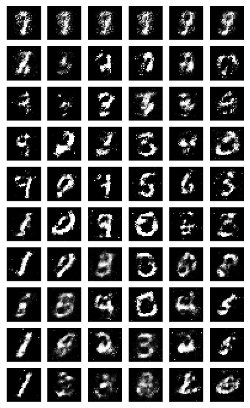

# gan-mnist
Generate MNIST data by generative Adversarial Networks in python

## Project Overview

In this project, I defined generator and discriminator on a MNIST dataset. The goal of this project is to get a generator network to generate _new_ images of handwritten digits that look as realistic as possble. The image below is a result of the training:
 


### Instruction

1. Clone the repository and navigage to the downloaded folder.
	```
		git clone https://github.com/rakshitsakhuja/gan-mnist
		cd gan-mnist
	```
2. Open the `dlnd_face_generation.ipynb` file.
	```
		jupyter notebook dlnd_face_generation.ipynb
	```
3. Read and follow the instructions! This repository does not include the dataset. You can find and download it in the notebook.

### Libraries

- [PyTorch](https://pytorch.org)

